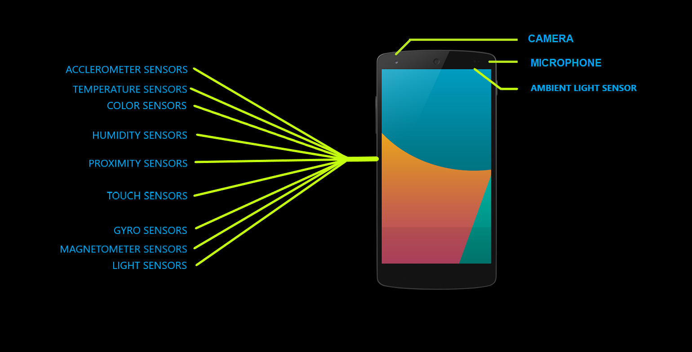
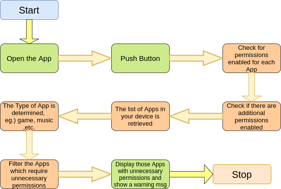

## BUTTONTOPRIVACY(B2p)
updated source code for finals submission is in SourceForB2p_Finals.zip

**Team Name:** ZenSpyder

**Theme:** Atma Nirbhar Bharat

## Let&#39;s start with a fundamental question…Are all the information stored on your android phone private?

The short answer is no. Wouldn&#39;t you like to keep certain parts of their lives private?? We do too. And therefore we introduce to you the button to privacy (B2p). It&#39;s time to take your privacy back.

**Many such sensors located in your smartphone and apps can read data anytime from these. Some malicious apps can exploit this to invade your privacy.**

Apps work with permissions. A malicious app acquires more permissions than the allotted and accesses uses these permissions to access your contacts, camera and even track you using GPS.

About a month back, the government of India decided to ban a number of chinese made apps due to them being guilty of stealing data. One such app was Du Privacy. We are proposing to build an indigenously developed privacy app that will do much more than what Du Privacy was said to do to help protect your privacy at the app level.

## Operational Instructions

1. Open the B2p app.

1. If you have an antivirus software installed on your phone make sure you whitelist B2p as it is not deployed in the play store yet.

1. Press the privacy button once and wait for 5 about minutes.

1. The app will process and find out about which apps use permissions that are not needed by them.

1. See the displayed information carefully

1. Review the flagged apps.

## Working

1. Once the user presses the button, B2p extracts information about the apps installed on their phone.

1. B2p then categorizes their apps into predefined categories ( each with their defined permissions). It extracts the category of the app from the installed app's manifest.

1. If B2p detects that an app is using permissions not usually required by its category, we flag it.

1. The information is then displayed for review to the user where he can review the displayed apps and make sure they are from a trusted reviewer.

1. The unique feature of B2P is that it runs entirely from the user&#39;s side which makes it run quicker than server side applications.

## Limitations

1. Categorization would work only on applications developed after 2016-17. 
2. Will not work on iOS devices.

## Compatibility

1.Min version of Android needed: Oreo
2.The application is compatible on most phones which run on android. Some phones such as One plus are not compatible for the time being.
3.The application is only designed to work in portrait mode for the time being.

## Requirements and Permissions

1. No special permissions

## Planned improvements

1. Better designed interactive UI
2. Better categorization of apps using Machine Learning.
3. Implementation to work on the OS level to act as a firewall for inbound and outbound connections.

## Conclusion :

As privacy is the most important thing in this 21th century, our app provides complete protection to your personal data.You will get an awareness of the various permissions of the apps you install. B2P is very much user friendly and easy to use type with many customizable options. Currently it is a basic prototype but after this hackathon many interesting features will be added.
